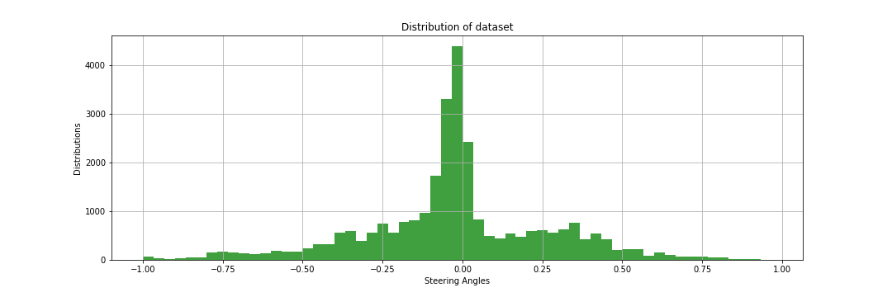
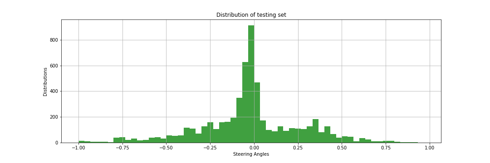

<!-- 
**********************************************************************
https://review.udacity.com/#!/rubrics/432/view

Project Specification
Behavioral Cloning

Required Files
    1 - Are all required files submitted?: The submission includes a model.py file, drive.py, model.h5 a writeup report and video.mp4.

Quality of Code
    2 - Is the code functional?:The model provided can be used to successfully operate the simulation.
    3 - Is the code usable and readable?: The code in model.py uses a Python generator, if needed, to generate data for training rather than storing the training data in memory. The model.py code is clearly organized and comments are included where needed.

Model Architecture and Training Strategy
    4 - Has an appropriate model architecture been employed for the task?: The neural network uses convolution layers with appropriate filter sizes. Layers exist to introduce nonlinearity into the model. The data is normalized in the model.
    5 - Has an attempt been made to reduce overfitting of the model?: Train/validation/test splits have been used, and the model uses dropout layers or other methods to reduce overfitting.
    6 - Have the model parameters been tuned appropriately?: Learning rate parameters are chosen with explanation, or an Adam optimizer is used. 
    7 - Is the training data chosen appropriately?: Training data has been chosen to induce the desired behavior in the simulation (i.e. keeping the car on the track).

Architecture and Training Documentation
    8 - Is the solution design documented?: The README thoroughly discusses the approach taken for deriving and designing a model architecture fit for solving the given problem.
    9 - Is the model architecture documented?: The README provides sufficient details of the characteristics and qualities of the architecture, such as the type of model used, the number of layers, the size of each layer. Visualizations emphasizing particular qualities of the architecture are encouraged. Here is one such tool for visualization.
    10 - Is the creation of the training dataset and training process documented?: The README describes how the model was trained and what the characteristics of the dataset are. Information such as how the dataset was generated and examples of images from the dataset must be included.

Simulation
    11 - Is the car able to navigate correctly on test data?: No tire may leave the drivable portion of the track surface. The car may not pop up onto ledges or roll over any surfaces that would otherwise be considered unsafe (if humans were in the vehicle).

Suggestions to Make Your Project Stand Out!
    12 - The simulator contains two tracks. To meet specifications, the car must successfully drive around track one. Track two is more difficult. See if you can get the car to stay on the road for track two as well.

**********************************************************************
-->
# **P4 - Behavioral Cloning** 
### **Description**

In this project, I used what I've learned about deep neural networks and convolutional neural networks to clone driving behavior. I trained, validated and tested a model using Keras. The model outputs the steering angle to control an autonomous vehicle in a simulated environment.

  

The goals / steps of this project are the following:
* Use the simulator to collect data of good driving behavior.
* Build, a convolution neural network in Keras that predicts steering angles from images.
* Train and validate the model with a training set and validation set.
* Test that the model successfully drives around track one without leaving the road, track two is optional.
* Summarize the results with a written report.

---
### Files Submitted & Code Quality

#### 1. Submission includes all required files and can be used to run the simulator in autonomous mode

My project includes the following files:
* The [`Traffic_Sign_Classifier.ipynb`](https://github.com/JohnBetaCode/CarND-P4-Behavioral_Cloning/blob/master/CarND-P4-Behavioral_Cloning.ipynb) containing the script/Notebook to create and train the model.
* [`Traffic_Sign_Classifier.md`](https://github.com/JohnBetaCode/CarND-P4-Behavioral_Cloning/blob/master/CarND-P4-Behavioral_Cloning.md) writeup to summarize the results.
* The [`utils.py`](https://github.com/JohnBetaCode/CarND-P4-Behavioral_Cloning/blob/master/utils.py) with utils function to visualize and train the datasets.
* The [`drive.py`](https://github.com/JohnBetaCode/CarND-P4-Behavioral_Cloning/blob/master/drive.py) for driving the car in autonomous mode.
* The [`behavioral_model.h5`](https://github.com/JohnBetaCode/CarND-P4-Behavioral_Cloning/blob/master/model/behavioral_model.h5) file containing a trained convolution neural network. 
* The [`driving_track_1.mp4`](https://github.com/JohnBetaCode/CarND-P4-Behavioral_Cloning/blob/master/driving_track_1.mp4) video with autonomous driving over track 1.
* The [`driving_track_2.mp4`](https://github.com/JohnBetaCode/CarND-P4-Behavioral_Cloning/blob/master/driving_track_2.mp4) video with autonomous driving over track 2.
* The [`driving_track_1&2.mp4`](https://github.com/JohnBetaCode/CarND-P4-Behavioral_Cloning/blob/master/driving_track_1&2.mp4) video with autonomous driving over track 1 and 2, perspective view from central camera.

#### 2. Submission Includes Functional Code
Using the Udacity provided [simulator](https://github.com/udacity/self-driving-car-sim) and my `drive.py` file, the car can be driven autonomously around the track by executing:

```sh
python drive.py model.h5
```
or you can run everything and much easier running the final blocks in the `Traffic_Sign_Classifier.ipynb` in the section `Run Simulation Environment, Model and Other Utils`, these blocks, run the simulator and the `drive.py` files for you, also provide tools for screen recording and other utils.

#### 3. Submission Code Is Usable And Readable

The `Traffic_Sign_Classifier.ipynb` notebook file contains the code for training and saving the convolution neural network. The file shows the pipeline I used for training and validating the model, and it contains comments to explain how the code works.

### Model Architecture And Training Strategy

#### 4. Image Dataset

Before dive in how the pipe line works, let's discuss how is the data that we're going to train. The Datasets include images and `driving_log.csv` files that path to the images. Each frame has 3 images which comes from left camera, center camera and right camera. So, when reading `driving_log.csv` files each row has ‘center, left, right, steering, throttle, brake, speed’ columns. The three camera images (center, left, right) were used as input and steering as target.

I used two functions to load images. The firsts, `load_dataset()` loads the datasets information reading the csv files and taking line by line. this functions returns a list of dictionaries with the paths to center, left, and right images as the steering angle. The keys are `img_c` for central camera image, `img_l` for left camera image, `img_r` for right camera image, and `steering` for the steering angle value. 

The second function is `generator()`, which is used to read the datasets images from the previous dictionaries in batches and return them. The images captured in the car simulator are large, a size of 160 x 320 x 3 means that storing 10,000 simulator images would take over 1.5 GB. That's a lot of memory! Not to mention that preprocessing data can change data types from an int to a float, which can increase the size of the data by a factor of 4. This generator function is a great way to work with large amounts of data. Instead of storing the pre-processed data in memory all at once, using a generator you can pull pieces of the data and process them on the fly only when you need them, which is much more memory-efficient. A generator is like a coroutine, a process that can run separately from another main routine, which makes it a useful Python function. Instead of using return, the generator uses yield, which still returns the desired output values but saves the current values of all the generator's variables. When the generator is called a second time it re-starts right after the yield statement, with all its variables set to the same values as before.

#### 5. Creation of the Training Set

To capture good driving behavior, I first recorded some laps on the track one using center lane driving. Here is an example image of center lane driving:


From cameras view perspective:


I then recorded the vehicle recovering from the left side and right sides of the road back to center so that the vehicle would learn to recover itself when is going out the way. These images show what a recovery looks like:  


Then I repeated this process on track two in order to get more data points.


Images above show how I initially drove the vehicle over the right lane, but this did not work. When I tested the model the car went off the road. So, I decided to drive in the center of the road between right and left lane, so the car is driven safely.

The two generators explained, `train_generator` and `validation_generator` use OpenCV to load the images, by default the images read by OpenCV are in BGR format, so we need to convert them to RGB as in `drive.py`. Since we have a steering angle associated with three images we introduce a correction factor (0.2) for left and right images adding/subtracting from center camera steering angle. To augment the dataset even more, the generators also flip the three images and their angles. This is how we drive in the other way.

Here is an image that has been flipped (you can see now the lake is over the right side):


Finally the data set is randomly shuffled, so the order in which images comes doesn't matters to the CNN. So according with this approach we are able to generate 6 images corresponding to one entry for each ``driving_log.csv`` file.

I decided to split the dataset into training and validation set using sklearn preprocessing library. I decided to keep 20% of the data in Validation Set and remaining in Training Set. I am using a generator to generate the data so as to avoid loading all the images in the memory and instead generate it at the run time in batches of 32. Even Augmented images are generated inside the generators.

The next histogram shows how the Dataset is distributed, we can see  how the steering angles are balanced so the model is not going to over-fit in a turning side.



It looks Gaussian. Nice because it makes car more straight drive. We can improve it but I think it is enough for training.

The next histogram for the Testing set:



The next histogram for the Training set:


It is worth mentioning that when data augmentation is applied, the data histogram will be more symmetric and balanced.

Not all of these pixels contain useful information, however. In the previous images above, the top portion of the image captures trees and hills and sky, and the bottom portion of the image captures the hood of the car. The model might train faster if each image is cropped to focus on only the portion of the image that is useful for predicting a steering angle. So, the hyper parameters `DOWN_LIMIT=20` and `UP_LIMIT=65` are used to crop the images `UP_LIMIT` rows pixels from the top, and `DOWN_LIMIT` rows pixels from the bottom. Here is the image that model is going to learn from:


#### 6. An Appropriate Model Architecture Has Been Employed

For the actual network architecture, the Nvidia model is used because of its simplicity and demonstrated ability to perform well on self-driving car tasks. 

   

The network architecture implementation is fairly straightforward. First we have a Lambda layer that normalizes our input image. What follows are 5 Conv2d layers, each followed by a BatchNormalization and a ReLU Activation layer.

After the 5 convolutional layers, these multidimensional layers are flattened into what can be thought of as a column vector and fed into 3 plain fully connected layers with the final layer outputting the predicted steering angle.

Here is a visualization of the architecture:


Total parameter is around 500.000. But it is not a big number if you use GPU.

#### 7. Attempts To Reduce Over-fitting In The Model

After the full connected layer, the model contains dropout layers in order to reduce over-fitting. I have used a dropout so that the model generalizes on a track that it has not seen. I decided to keep the Dropout rate as 0.25 to combat over-fitting. The model was tested by running it through the simulator and ensuring that the vehicle could stay on the track.

#### 8. Model Parameter Tuning

        EPOCHS - No of epochs= 20
        BATCH_SIZE - Generator batch size= 128
        CORRECTION - Correction factor- 0.2
        UP_LIMIT = 65 Up Horizontal limits to crop images
        DOWN_LIMIT = 20 Down Horizontal limits to crop dataset
        Learning Rate- Default 0.001
        Validation Data split +-0.20
        Optimizer Used- Adam

#### 9. Solution Design Approach And Results

The final step was to run the simulator to see how well the car was driving around track one. There were a few spots where the vehicle fell off the track at the beginning. to improve the driving behavior in these cases, I collected more data from track 1 where the vehicle had more problems to drive, when I got a model to drive over one lap without leave the road or have crashes, I proceed to capture data in track two, after tunning my hyper parameters I got the final model with the next training graph:


At the end of the process, the vehicle is able to drive autonomously around the track one and two without leaving the road.

#### 10. Video Results
* [`CarND-P4-Behavioral_Cloning-Track_1-Center_Camera-Udacity`](https://youtu.be/LeTQwCUofuY)  
* [`CarND-P4-Behavioral_Cloning-Track_2-Center_Camera-Udacity`](https://youtu.be/oXsQAJtn6zg)  
* [`CarND-P4-Behavioral_Cloning-Track_1&2-Center_Camera-Udacity`](https://www.youtube.com/watch?v=vC5pB9lv0DE) 

---
> **Date:** &nbsp; 04/07/2019  
> **Programmer:** &nbsp;John A. Betancourt G.   
> **Mail:** &nbsp;john.betancourt93@gmail.com  
> **Web:** &nbsp; www.linkedin.com/in/jhon-alberto-betancourt-gonzalez-345557129 

 

Sorry for my English

<!-- Sorry for my English -->