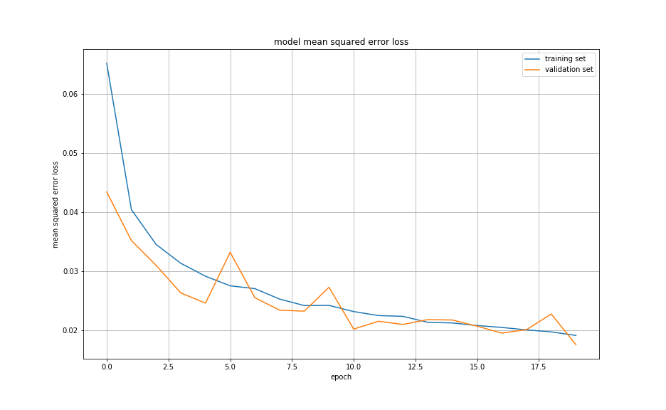

<!-- 
**********************************************************************
https://review.udacity.com/#!/rubrics/432/view

Project Specification
Behavioral Cloning

Required Files
    (OK) - 1 - Are all required files submitted?: The submission includes a model.py file, drive.py, model.h5 a writeup report and video.mp4.

Quality of Code
    (OK) - 2 - Is the code functional?:The model provided can be used to successfully operate the simulation.
    (OK) - 3 - Is the code usable and readable?: The code in model.py uses a Python generator, if needed, to generate data for training rather than storing the training data in memory. The model.py code is clearly organized and comments are included where needed.

Model Architecture and Training Strategy
    (OK) - 4 - Has an appropriate model architecture been employed for the task?: The neural network uses convolution layers with appropriate filter sizes. Layers exist to introduce nonlinearity into the model. The data is normalized in the model.
    (OK) - 5 - Has an attempt been made to reduce overfitting of the model?: Train/validation/test splits have been used, and the model uses dropout layers or other methods to reduce overfitting.
    (OK) - 6 - Have the model parameters been tuned appropriately?: Learning rate parameters are chosen with explanation, or an Adam optimizer is used. 
    (OK) - 7 - Is the training data chosen appropriately?: Training data has been chosen to induce the desired behavior in the simulation (i.e. keeping the car on the track).

Architecture and Training Documentation
    (OK) - 8 - Is the solution design documented?: The README thoroughly discusses the approach taken for deriving and designing a model architecture fit for solving the given problem.
    (OK) - 9 - Is the model architecture documented?: The README provides sufficient details of the characteristics and qualities of the architecture, such as the type of model used, the number of layers, the size of each layer. Visualizations emphasizing particular qualities of the architecture are encouraged. Here is one such tool for visualization.
    (OK) - 10 - Is the creation of the training dataset and training process documented?: The README describes how the model was trained and what the characteristics of the dataset are. Information such as how the dataset was generated and examples of images from the dataset must be included.

Simulation
    (OK) - 11 - Is the car able to navigate correctly on test data?: No tire may leave the drivable portion of the track surface. The car may not pop up onto ledges or roll over any surfaces that would otherwise be considered unsafe (if humans were in the vehicle).

Suggestions to Make Your Project Stand Out!
    (OK) - 12 - The simulator contains two tracks. To meet specifications, the car must successfully drive around track one. Track two is more difficult. See if you can get the car to stay on the road for track two as well.


https://medium.com/@erikshestopal/udacity-behavioral-cloning-using-keras-ff55055a64c

https://medium.com/deep-learning-turkey/behavioral-cloning-udacity-self-driving-car-project-generator-bottleneck-problem-in-using-gpu-182ee407dbc5

**********************************************************************
-->

# **P4 - Behavioral Cloning** 
### **Description**

In this project, I used what I've learned about deep neural networks and convolutional neural networks to clone driving behavior. I trained, validated and tested a model using Keras. The model outputs the steering angle to control an autonomous vehicle in a simulated enviorement.

  

The goals / steps of this project are the following:
* Use the simulator to collect data of good driving behavior
* Build, a convolution neural network in Keras that predicts steering angles from images
* Train and validate the model with a training and validation set
* Test that the model successfully drives around track one without leaving the road
* Summarize the results with a written report  

---
### Files Submitted & Code Quality

#### 1. Submission includes all required files and can be used to run the simulator in autonomous mode

My project includes the following files:
* The [`Traffic_Sign_Classifier.ipynb`](https://github.com/JohnBetaCode/CarND-P4-Behavioral_Cloning/blob/master/CarND-P4-Behavioral_Cloning.ipynb) containing the script/Notebook to create and train the model
* [`Traffic_Sign_Classifier.MD`](https://github.com/JohnBetaCode/CarND-P4-Behavioral_Cloning/blob/master/CarND-P4-Behavioral_Cloning.md) or writeup_report.pdf summarizing the results
* The [`utils.py`](https://github.com/JohnBetaCode/CarND-P4-Behavioral_Cloning/blob/master/utils.py) with utils function to visualize and traing datasets.
* The [`drive.py`](https://github.com/JohnBetaCode/CarND-P4-Behavioral_Cloning/blob/master/drive.py) for driving the car in autonomous mode
* The [`model.h5`](PUT LINK HERE) containing a trained convolution neural network 

#### 2. Submission includes functional code
Using the Udacity provided [simulator](https://github.com/udacity/self-driving-car-sim) and my `drive.py` file, the car can be driven autonomously around the track by executing 
```sh
python drive.py model.h5
```
or you can run everything and much easier running the final blocks in the `Traffic_Sign_Classifier.ipynb` in the section `Run Simulation Enviroment, Model and Other Utils`, these blocks, run the simulator and the `drive.py` file for you, also provide tools for screen recorder and others.

#### 3. Submission code is usable and readable

The `Traffic_Sign_Classifier.ipynb` notebook file contains the code for training and saving the convolution neural network. The file shows the pipeline I used for training and validating the model, and it contains comments to explain how the code works.

### Model Architecture and Training Strategy

#### 1. Image Dataset

The Data includes images and `driving_log.csv` files that path of the images. Each frame has 3 images which comes from left camera, centre camera and right camera. So, when reading `driving_log.csv` file each row has ‘center, left, right, steering, throttle, brake, speed’ columns. The three camera images (center, left, right) were used as input and steering as target.

I used two functions to load images. `load_dataset()`, read the datasets information reading the csv files and load by line by line. this functions returns a list of dictionaries with the paths to center, left, and right images as the steering angle for these samples. The keys are `img_c` for central camera image, `img_l` for left camera image, `img_r` for right camera image, and `steering` for the steering angle value. 

Second function `generator()` is used to read the datsets images from the previous dictionaries in batches and return them. The images captured in the car simulator are large, a size of 160 x 320 x 3 means that storing 10,000 simulator images would take over 1.5 GB. That's a lot of memory! Not to mention that preprocessing data can change data types from an int to a float, which can increase the size of the data by a factor of 4. `load_dataset()` is a generators, which is a great way to work with large amounts of data. Instead of storing the pre-processed data in memory all at once, using a generator you can pull pieces of the data and process them on the fly only when you need them, which is much more memory-efficient. A generator is like a coroutine, a process that can run separately from another main routine, which makes it a useful Python function. Instead of using return, the generator uses yield, which still returns the desired output values but saves the current values of all the generator's variables. When the generator is called a second time it re-starts right after the yield statement, with all its variables set to the same values as before.

#### 2. Creation of the Training Set


#### 1. An appropriate model architecture has been employed

For the actual network architecture, the Nvidia model is used because of its simplicity and demonstrated ability to perform well on self-driving car tasks. 

   

The network architecture implementation is fairly straightforward. First we have a Lambda layer that normalizes our input image. What follows are 5 Conv2d layers, each followed by a BatchNormalization and a ReLU Activation layer.

After the 5 convolutional layers, these multidimensional layers are flattened into what can be thought of as a column vector and fed into 3 plain fully connected layers with the final layer outputting the predicted steering angle.


#### 2. Attempts to reduce overfitting in the model

The model contains dropout layers in order to reduce overfitting (model.py lines 21). 

The model was trained and validated on different data sets to ensure that the model was not overfitting (code line 10-16). The model was tested by running it through the simulator and ensuring that the vehicle could stay on the track.

#### 3. Model parameter tuning

The model used an adam optimizer, so the learning rate was not tuned manually (model.py line 25).

#### 4. Appropriate training data

Training data was chosen to keep the vehicle driving on the road. I used a combination of center lane driving, recovering from the left and right sides of the road ... 

For details about how I created the training data, see the next section. 

### Model Architecture and Training Strategy

#### 1. Solution Design Approach

The overall strategy for deriving a model architecture was to ...

My first step was to use a convolution neural network model similar to the ... I thought this model might be appropriate because ...

In order to gauge how well the model was working, I split my image and steering angle data into a training and validation set. I found that my first model had a low mean squared error on the training set but a high mean squared error on the validation set. This implied that the model was overfitting. 

To combat the overfitting, I modified the model so that ...

Then I ... 

The final step was to run the simulator to see how well the car was driving around track one. There were a few spots where the vehicle fell off the track... to improve the driving behavior in these cases, I ....

At the end of the process, the vehicle is able to drive autonomously around the track without leaving the road.

#### 2. Final Model Architecture

The final model architecture (model.py lines 18-24) consisted of a convolution neural network with the following layers and layer sizes ...

Here is a visualization of the architecture (note: visualizing the architecture is optional according to the project rubric)

![alt text][image1]

#### 3. Creation of the Training Set & Training Process

To capture good driving behavior, I first recorded two laps on track one using center lane driving. Here is an example image of center lane driving:


I then recorded the vehicle recovering from the left side and right sides of the road back to center so that the vehicle would learn to .... These images show what a recovery looks like starting from ... :


Then I repeated this process on track two in order to get more data points.


To augment the data sat, I also flipped images and angles thinking that this would ... For example, here is an image that has then been flipped:

  


Etc ....

After the collection process, I had X number of data points. I then preprocessed this data by ...

I finally randomly shuffled the data set and put Y% of the data into a validation set. 

I used this training data for training the model. The validation set helped determine if the model was over or under fitting. The ideal number of epochs was Z as evidenced by ... I used an adam optimizer so that manually training the learning rate wasn't necessary.




---

> **Date:** &nbsp; 03/20/2019  
> **Programmer:** &nbsp;John A. Betancourt G.   
> **Mail:** &nbsp;john.betancourt93@gmail.com  
> **Web:** &nbsp; www.linkedin.com/in/jhon-alberto-betancourt-gonzalez-345557129 

 

<!-- Sorry for my English -->
