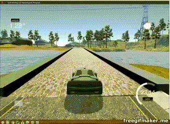

<!-- https://review.udacity.com/#!/rubrics/432/view -->

# Behavioral Cloning Project
[](http://www.udacity.com/drive)


  
  
  

  
  
  


## Overview

In this project, I used what I've learned about deep neural networks and convolutional neural networks to clone driving behavior. I trained, validated and tested a model using Keras. The model outputs the steering angle to control an autonomous vehicle in a simulated enviorement.

The [simulator](https://github.com/udacity/self-driving-car-sim) is used to steer a car around a track, and for data collection. Image data were used with steering angles to train a neural network and then use the model to drive the car autonomously around the track.

To meet specifications, The following files are attached in this repository: 
* [CarND-P4-Behavioral_Cloning.ipynb](https://github.com/JohnBetaCode/CarND-P4-Behavioral_Cloning/blob/master/CarND-P4-Behavioral_Cloning.ipynb) (Notebook used to create and train the model)
* [CarND-P4-Behavioral_Cloning.md](https://github.com/JohnBetaCode/CarND-P4-Behavioral_Cloning/blob/master/CarND-P4-Behavioral_Cloning.md) (Report writeup file)
* [drive.py](https://github.com/JohnBetaCode/CarND-P4-Behavioral_Cloning/blob/master/drive.py) (script to drive the car)
* [model.h5](https://github.com/JohnBetaCode/CarND-P4-Behavioral_Cloning/blob/master/model/behavioral_model.h5) (a trained Keras model)
* [video]() recording of the vehicle driving autonomously around the track for one full lap


## The Project

The goals / steps of this project are the following:
* Use the simulator to collect data of good driving behavior 
* Design, train and validate a model that predicts a steering angle from image data
* Use the model to drive the vehicle autonomously around the first track in the simulator. The vehicle should remain on the road for an entire loop around the track.

## Dependencies

This lab requires:

* [CarND Term1 Starter Kit](https://github.com/udacity/CarND-Term1-Starter-Kit)

The lab enviroment can be created with CarND Term1 Starter Kit. Click [here](https://github.com/udacity/CarND-Term1-Starter-Kit/blob/master/README.md) for the details.

Be sure that you have the next dependencies:

        pip install "python-socketio[client]"  
        sudo python3 -m pip install eventlet  
        sudo python3 -m pip install flask  

## Details About Files In This Directory

Usage of `drive.py` requires you have saved the trained model as an h5 file, i.e. `model.h5`. See the [Keras documentation](https://keras.io/getting-started/faq/#how-can-i-save-a-keras-model) for how to create this file using the following command:

```sh
model.save(filepath)
```

Once the model has been saved, it can be used with drive.py using this command:

```sh
python drive.py model.h5
```

The above command will load the trained model and use the model to make predictions on individual images in real-time and send the predicted angle back to the server via a websocket connection.

Note: There is known local system's setting issue with replacing "," with "." when using `drive.py`. When this happens it can make predicted steering values clipped to max/min values. If this occurs, a known fix for this is to add "export LANG=en_US.utf8" to the bashrc file.

#### Saving a video of the autonomous agent

```sh
python drive.py model.h5 run1
```

The fourth argument, `run1`, is the directory in which to save the images seen by the agent. If the directory already exists, it'll be overwritten.

```sh
ls run1

[2017-01-09 16:10:23 EST]  12KiB 2017_01_09_21_10_23_424.jpg
[2017-01-09 16:10:23 EST]  12KiB 2017_01_09_21_10_23_451.jpg
[2017-01-09 16:10:23 EST]  12KiB 2017_01_09_21_10_23_477.jpg
[2017-01-09 16:10:23 EST]  12KiB 2017_01_09_21_10_23_528.jpg
[2017-01-09 16:10:23 EST]  12KiB 2017_01_09_21_10_23_573.jpg
[2017-01-09 16:10:23 EST]  12KiB 2017_01_09_21_10_23_618.jpg
[2017-01-09 16:10:23 EST]  12KiB 2017_01_09_21_10_23_697.jpg
[2017-01-09 16:10:23 EST]  12KiB 2017_01_09_21_10_23_723.jpg
[2017-01-09 16:10:23 EST]  12KiB 2017_01_09_21_10_23_749.jpg
[2017-01-09 16:10:23 EST]  12KiB 2017_01_09_21_10_23_817.jpg
...
```

The image file name is a timestamp of when the image was seen. This information is used by `video.py` to create a chronological video of the agent driving.

```sh
python video.py run1
```

Creates a video based on images found in the `run1` directory. The name of the video will be the name of the directory followed by `'.mp4'`, so, in this case the video will be `run1.mp4`.

Optionally, one can specify the FPS (frames per second) of the video:

```sh
python video.py run1 --fps 48
```

Will run the video at 48 FPS. The default FPS is 60.

#### Why create a video

1. It's been noted the simulator might perform differently based on the hardware. So if your model drives succesfully on your machine it might not on another machine (your reviewer). Saving a video is a solid backup in case this happens.
2. You CAN slightly alter the code in `drive.py` and/or `video.py` to create a video of what your model sees after the image is processed (may be helpful for debugging).

### Tips
- Please keep in mind that training images are loaded in BGR colorspace using cv2 while drive.py load images in RGB to predict the steering angles.

 